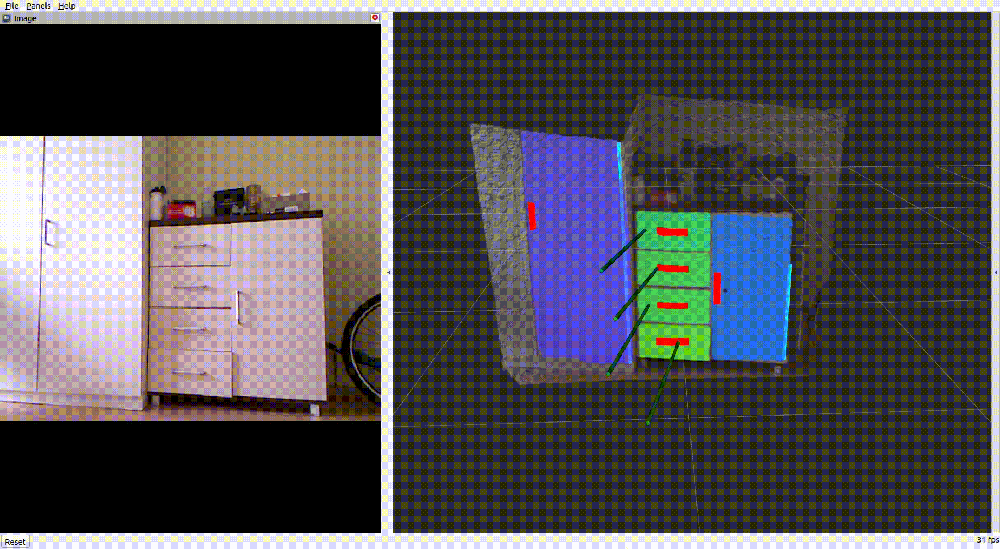
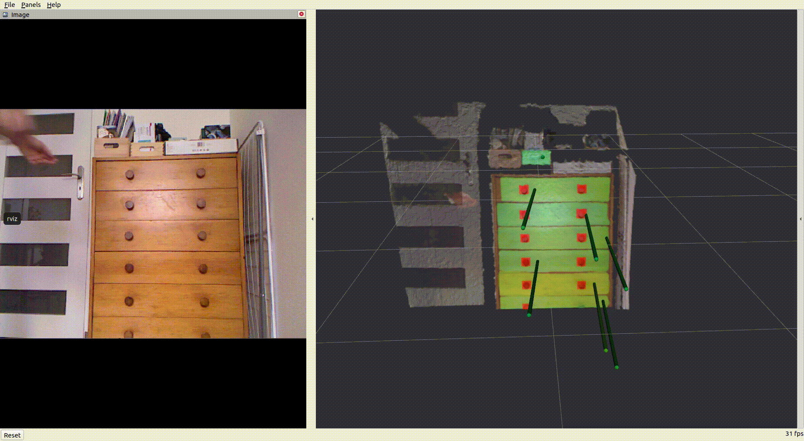

# articulated_objects_scene_builder

<p align="center">
  
&nbsp; &nbsp; &nbsp; &nbsp;
  
&nbsp; &nbsp; &nbsp; &nbsp;
  
</p>

The goal of the project is to build a ROS system that would be able to build a point-cloud-based model of the scene enhanced with information about articulated objects based on a **single** RGB-D image. The articulated objects defined by this work are **drawers, wardrobes, and cabinets.**

### The information about articulated objects contains:
- a location of the object and a class of the object
- a handler of the object to interact it
- a rotational joint or transitional joint estimation

### Features:
- estimation of object parameters without the need to interact with the object - improved time of the estimation, reduces the risk of damaging the object 
- estimation of many objects at the same time
- localizing the objects in the scene
- the object might be in a random state during estimation

This project estimates the parameters of those objects without the need to interact with the object. This improves the time of the estimation and reduces the risk of damaging the object during estimation, comparing to the classic methods of estimation.

This module is part of my master thesis "Point cloud-based model of the scene enhanced with information about articulated objects"

This node concatenates results and runs on top of the previous three nodes that are available here:

- [Handler detector](https://github.com/arekmula/ros_handler_detector)
- [Front detector](https://github.com/arekmula/ros_front_detection_segmentation)
- [Rotational joint detector](https://github.com/arekmula/ros_joint_detection)

to build a final model of the scene in a 3D environment.

### The node subsribes to the following topics:
- topic with Microsoft Kinect point cloud, that can be set using `rosparam set input_point_cloud_topic "input_point_cloud_topic"`
- `front_prediction` which contains information about detected fronts of articulated objects. 
- `handler_prediction_topic` which contains information about detected handlers of articulated objects. 
-  `joint_prediction_topic` which contains information about detected joints of articulated objects that are rotational. 

### The node publish following topics:
- `image_to_process` - RGB image obtained from input point cloud, which has to be processed by the rest of the nodes
- `cloud_to_process` - currently processed point cloud
- `processed_fronts_point_cloud` - Processed point cloud with fronts data
- `processed_handlers_point_cloud` - Processed point cloud with handlers data
- `trans_fronts_normals` - Normals of transitional objects
- `rot_front_joints` - Rotational joints
- `last_processed_point_cloud` - Point cloud that was processed a moment ago

## Dataset
The dataset that was used using developing the project is available here:
- [part1](https://drive.google.com/file/d/1fhE5tN_5AM1CKty76QT63WNsISecXsl7/view?usp=sharing)
- [part2](https://drive.google.com/file/d/1k008_vaWegVhvY-ULVqCNqPQ12pFojvO/view?usp=sharing)

The dataset consists of 38 rosbag sequences, which contain 32 unique transitional objects and 53 unique rotational objects.
## Results

The results gathered on the dataset above looks as follow:
-   Mean time of scene building: 1.9393s
```markdown
|                                         | Transitional objects | Rotational Objects |
|:---------------------------------------:|:--------------------:|--------------------|
|   Found fronts/Total number of fronts   |         31/32        |        50/53       |
|   Found joints/Total number of joints   |         31/32        |        46/53       |
| Found handlers/Total number of handlers |         39/40        |        50/53       |
```
## Dependencies
- ROS Noetic
- PCL library `sudo apt install libpcl-dev`

## Run with
```
rosparam set input_point_cloud_topic "input_point_cloud_topic"
roslaunch model_builder model_builder.launch 
```
Run nodes responsible for handler, front and rotational joint detection.
